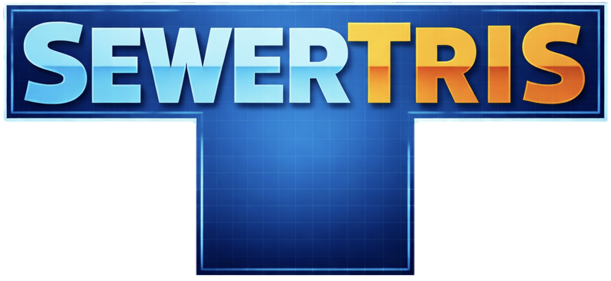
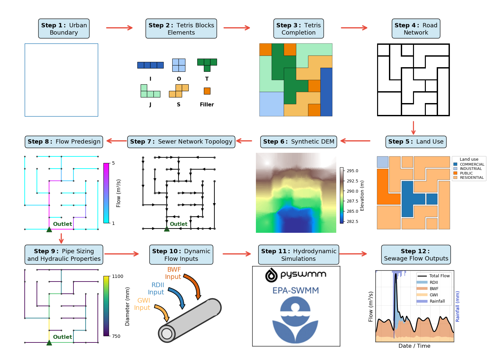

# SewerTris
**SewerTris** is a Python framework for generating synthetic urban layouts and sanitary sewer networks, and for simulating their hydrologic–hydraulic behavior in EPA-SWMM for controlled experimentation, methodological benchmarking, and sensitivity analysis of sanitary sewer system design and monitoring, supporting research and infrastructure planning.

<p align="center">
  
<p align="center">
  
</p>

---

## 🌎 Purpose

Observational sewer datasets are limited, system-specific, and often incomplete, restricting the evaluation of monitoring strategies, calibration methods, and design approaches.  
SewerTris addresses this gap by creating **digital experimental sewer systems** that preserve governing physical processes while allowing controlled variation in:

- urban layout and morphology  
- sewer network geometry and connectivity  
- hydrologic inputs (DWF, GWI, RDII, rainfall)  
- hydraulic and structural parameters  

This enables **systematic benchmarking, sensitivity analysis, and reproducible research** for urban hydrology and wastewater infrastructure.

---
## 🧩 Core Capabilities

SewerTris provides tools to:

- Generate **synthetic urban domains** using grid-based and block-structured layouts  
- Construct **tree-structured sanitary sewer networks** with physically consistent elevations and slopes  
- Assign **hydrologic components**:
  - Dry-weather flow (DWF)  
  - Groundwater infiltration (GWI)  
  - Rainfall-derived inflow and infiltration (RDII)  
- Automatically create and run **EPA-SWMM models**  
- Produce **hydrographs, spatial datasets, and reproducible benchmarks** for I&I estimation and sewer system analysis  

---
## 🧠 Modeling Architecture

SewerTris follows a structured, twelve-step workflow that defines the complete synthetic sewer modeling pipeline. The framework is designed around a stochastic design philosophy, in which urban layouts and sewer networks are generated through randomized realizations of Tetris-based building blocks. This approach produces ensembles of physically plausible system configurations—referred to as *digital siblings*—that are structurally distinct yet governed by consistent physical and hydraulic rules.

<p align="center">
  
</p>

Hydraulic routing and dynamic flow simulation are performed using the industry-standard **EPA Storm Water Management Model (SWMM)**, fully integrated within the Python workflow. This integration makes SewerTris a self-contained and reproducible modeling environment suitable for benchmarking, sensitivity analysis, and hypothesis testing.

Below is a conceptual overview of the twelve modeling components:

### 1. Urban Boundary
Defines the spatial modeling boundary using a vector polygon or raster mask and establishes the sewer outlet location.

### 2. Tetris Block Elements
Specifies modular tetromino building blocks (i.e. I, O, T, J, S shapes) that form the geometric basis of the synthetic urban layout.

### 3. Tetris Completion
Populates the domain using randomized block placement to generate heterogeneous but coherent urban configurations.

### 4. Road Network
Derives a synthetic road network from block boundaries, ensuring topological consistency with urban structure.

### 5. Land Use
Assigns residential, commercial, industrial, public, and recreational land uses using rule-based or user-defined allocation strategies.

### 6. Synthetic DEM
Creates a hydraulically consistent Digital Elevation Model (DEM) enforcing global drainage toward the outlet.

### 7. Sewer Network Topology
Constructs a gravity-driven, tree-structured sewer network aligned with roads and embedded within the DEM.

### 8. Flow Predesign
Computes baseline peak discharges combining Dry-Weather Flow (DWF), Groundwater Infiltration (GWI), and Rainfall-Derived Inflow & Infiltration (RDII).

### 9. Pipe Sizing and Hydraulic Properties
Assigns pipe diameters, roughness, and invert elevations using Manning-based design principles.

### 10. Dynamic Flow Inputs
Specifies temporally resolved DWF, GWI, and RDII inputs, including rainfall forcing and spatial heterogeneity options.

### 11. Hydrodinamics Simulations
Performs unsteady hydraulic routing and enables component tagging (RAIN and DRY) for flow separation analysis.

### 12. Sewage Flow Outputs
Extracts and decomposes total flows into DWF, RDII, and residual GWI components for benchmarking and diagnostics.

---

This modular structure enables systematic experimentation across multiple synthetic realizations while preserving hydraulic coherence and physical plausibility. By separating geometric generation, hydrologic forcing, and hydraulic simulation, SewerTris supports reproducible ensemble analysis and method evaluation under controlled conditions.

---

## ⚙️ Installation

### 1. Clone the repository

```bash
git clone https://github.com/Perez-HydroSystems/sewertris.git
cd sewertris
```

### 2. Create and activate the environment

```bash
conda env create -f environment_sewertris.yml
conda activate sewertris
```

### 3. Install SewerTris (editable)

Register the package so that `import sewertris` works from anywhere:

```bash
pip install -e .
```

> Optional — expose the environment as a Jupyter kernel for the example notebooks:
> ```bash
> python -m ipykernel install --user --name sewertris --display-name "Python (sewertris)"
> ```

---
## 🚀 Quick Start

SewerTris is built around a `SewerTrisProject` that owns the output folder, standard files, and
metadata. A minimal end-to-end run looks like this (simplified — see the notebooks for complete,
runnable code):

```python
import sewertris as sp

# Create a project (owns its output directory and artifacts)
project = sp.SewerTrisProject("output_my_project", cell_size_m=100, name="My Project")

# 1–3. Domain definition + stochastic tetris layout
project.define_domain(domain_mask=mask, cell_size_m=100)
project.complete_tetris_layout(crs="EPSG:3857", seed=42)

# 4–7. Roads, land use, synthetic DEM, and the gravity sewer network
project.generate_roads(road_width=10)
project.assign_land_use()
project.generate_topography(config=sp.TopographyConfig())
project.generate_sewer_network_V2(road_width=10, block_size=200)

# 8–9. Flow predesign + pipe sizing
project.predesign_flows(land_use_info=LAND_USE_INFO)
project.design_pipes()

# 10–11. Export and run an EPA-SWMM scenario
project.export_swmm(options_dict=options)
scenario = project.create_run("baseline")
depths, flows = scenario.run_swmm(monitored_nodes=["OUTLET"], monitored_links=["P_OUTLET"])

# Bonus: animate the whole build (tetris → roads → manholes → sewer) as a GIF
sp.animate_pipeline(project, out_path=project.path("pipeline.gif"))
```

See the example notebooks in [`Examples/`](Examples/) for complete, runnable workflows.

---
## 📊 Example Notebooks

All notebooks live in [`Examples/`](Examples/). The `*_project` notebooks use the project-oriented
`SewerTrisProject` API; the matching non-`project` notebooks build the same workflow function-by-function.

- **example_01_my_first_sewertris_project.ipynb** — End-to-end first project from a raster-mask domain (layout → roads → DEM → sewer → EPA-SWMM) using the `SewerTrisProject` API.
- **example_01_my_first_sewertris.ipynb** — The same first workflow built step-by-step with explicit paths (no project object).
- **example_02_Stillwater_sewertris_project.ipynb** — Stillwater case generated from a real shapefile domain via the project API.
- **example_02_Stillwater_sewertris.ipynb** — Stillwater case built function-by-function from the shapefile domain.
- **example_03_Stillwater_4tetromino_sewertris_project.ipynb** — Sibling of the Stillwater project restricted to a 4-tetromino (I/O/T/S) block set.
- **example_04_Stillwater_GWI_RDII_heterogeneity_sewertris_project.ipynb** — Sibling exploring spatially heterogeneous GWI and RDII inputs.
- **example_05A_Stillwater_prepare_ensemble_siblings.ipynb** — Prepare an ensemble of stochastic siblings from a completed base project.
- **example_05B_Stillwater_run_ensemble_simulations.ipynb** — Run EPA-SWMM across the prepared ensemble of siblings.
- **example_05C_Stillwater_compare_ensemble_outputs.ipynb** — Aggregate and compare decomposed flow outputs across the ensemble.
- **example_siblings_types.ipynb** — Overview of sibling types and the `clone_sibling` / `rerun_from_parent_parameters` workflow.

---
## 🧪 Testing

Run tests with:

```bash
pytest
```
---
## 📚 Citation

If you use SewerTris in academic work, please cite:

```code
Blanco, K., & Perez, G. (2026).  
**SewerTris: Synthetic urban sanitary sewer system generator and EPA-SWMM benchmarking framework**  
```

A DOI will be generated after the first GitHub release via Zenodo.

---
## 📄 License


Released under the MIT License.
You are free to use, modify, and distribute this software with attribution.

---
## 👥 Authors

- Kevin Blanco
PhD Student — Civil & Environmental Engineering
Oklahoma State University
- Dr. Gabriel Pérez
Professor — Civil & Environmental Engineering
Oklahoma State University
https://experts.okstate.edu/gabriel.perez_mesa

