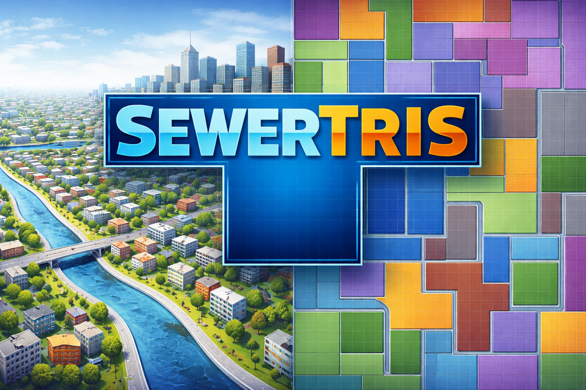

# SewerTris_0.1
**SewerTris** is a Python framework for generating synthetic urban layouts and sanitary sewer networks, and for simulating their hydrologic–hydraulic behavior in EPA-SWMM for controlled experimentation, methodological benchmarking, and sensitivity analysis of sanitary sewer system design and monitoring, supporting research and infrastructure planning.

<p align="center">
  
</p>

---

## 🌎 Purpose

Observational sewer datasets are limited, system-specific, and often incomplete, restricting the evaluation of monitoring strategies, calibration methods, and design approaches.  
SewerTris addresses this gap by creating **digital experimental sewer systems** that preserve governing physical processes while allowing controlled variation in:

- urban layout and morphology  
- sewer network geometry and connectivity  
- hydrologic inputs (DWF, GWI, RDII, rainfall)  
- hydraulic and structural parameters  

This enables **systematic benchmarking, sensitivity analysis, and reproducible research** for urban hydrology and wastewater infrastructure.

---
## 🧩 Core Capabilities

SewerTris provides tools to:

- Generate **synthetic urban domains** using grid-based and block-structured layouts  
- Construct **tree-structured sanitary sewer networks** with physically consistent elevations and slopes  
- Assign **hydrologic components**:
  - Dry-weather flow (DWF)  
  - Groundwater infiltration (GWI)  
  - Rainfall-derived inflow and infiltration (RDII)  
- Automatically create and run **EPA-SWMM models**  
- Produce **hydrographs, spatial datasets, and reproducible benchmarks** for I&I estimation and sewer system analysis  

---
## 🧠 Modeling Architecture

SewerTris follows a structured, twelve-step workflow that defines the complete synthetic sewer modeling pipeline. The framework is designed around a stochastic design philosophy, in which urban layouts and sewer networks are generated through randomized realizations of Tetris-based building blocks. This approach produces ensembles of physically plausible system configurations—referred to as *digital siblings*—that are structurally distinct yet governed by consistent physical and hydraulic rules.

<p align="center">
  
</p>

Hydraulic routing and dynamic flow simulation are performed using the industry-standard **EPA Storm Water Management Model (SWMM)**, fully integrated within the Python workflow. This integration makes SewerTris a self-contained and reproducible modeling environment suitable for benchmarking, sensitivity analysis, and hypothesis testing.

Below is a conceptual overview of the twelve modeling components:

### 1. Urban Domain Definition
Defines the spatial modeling boundary using a vector polygon or raster mask and establishes the sewer outlet location.

### 2. Tetris Block Definition
Specifies modular tetromino building blocks (I, L, T, S, Z shapes) that form the geometric basis of the synthetic urban layout.

### 3. Stochastic Tetris Completion
Populates the domain using randomized block placement to generate heterogeneous but coherent urban configurations.

### 4. Road Network Extraction
Derives a synthetic road network from block boundaries, ensuring topological consistency with urban structure.

### 5. Land-Use Assignment
Assigns residential, commercial, industrial, public, and recreational land uses using rule-based or user-defined allocation strategies.

### 6. Synthetic DEM Generation
Creates a hydraulically consistent Digital Elevation Model (DEM) enforcing global drainage toward the outlet.

### 7. Sewer Network Generation
Constructs a gravity-driven, tree-structured sewer network aligned with roads and embedded within the DEM.

### 8. Sewer Flow Predesign
Computes baseline peak discharges combining Dry-Weather Flow (DWF), Groundwater Infiltration (GWI), and Rainfall-Derived Inflow & Infiltration (RDII).

### 9. Pipe Sizing and Hydraulic Properties
Assigns pipe diameters, roughness, and invert elevations using Manning-based design principles.

### 10. Dynamic Flow Input Definition
Specifies temporally resolved DWF, GWI, and RDII inputs, including rainfall forcing and spatial heterogeneity options.

### 11. EPA-SWMM Simulation
Performs unsteady hydraulic routing and enables component tagging (RAIN and DRY) for flow separation analysis.

### 12. Flow Output Decomposition
Extracts and decomposes total flows into DWF, RDII, and residual GWI components for benchmarking and diagnostics.

---

This modular structure enables systematic experimentation across multiple synthetic realizations while preserving hydraulic coherence and physical plausibility. By separating geometric generation, hydrologic forcing, and hydraulic simulation, SewerTris supports reproducible ensemble analysis and method evaluation under controlled conditions.

---

## 📦 Repository Structure
```bash
sewertris/
├── src/sewertris/        # Python package source code
│   ├── core.py           # Network and urban generation
│   ├── plots.py          # Visualization utilities
│   └── swmm.py           # SWMM model creation and simulation
├── examples/             # Demonstration notebooks and sample inputs
│   └── notebooks/
├── tests/                # Basic unit and smoke tests
└── docs/                 # (Optional) documentation site
```
---

## ⚙️ Installation

### 1. Clone the repository

```bash
git clone https://github.com/KevinBlanco94/SewerTris_0.1.git
cd sewertris
```

### 2. Create a virtual environment

```bash
python -m venv .venv
source .venv/bin/activate      # macOS/Linux
# .venv\Scripts\activate       # Windows
```

### 3. Install the package

```bash
pip install -e .
```
---
## 🚀 Quick Start

After installation

```bash
import sewertris as st

# Example workflow (simplified)
city = st.generate_city(seed=42)
network = st.generate_sewer_network(city)
model = st.build_swmm_model(network)

results = st.run_swmm(model)
st.plot_hydrograph(results)
```
See the example notebooks in examples/notebooks/ for complete workflows.

---
## 🔬 Reproducible Research Applications

SewerTris enables:
- Synthetic benchmark dataset generation
- Hydrograph separation and I&I quantification
- Sensitivity analysis of sewer design parameters
- Evaluation of monitoring and calibration strategies
- Testing of data-driven or AI-based sewer models

Target users include:
- Urban hydrology researchers
- Wastewater utilities
- Infrastructure planners
- Environmental modeling scientists
---
## 📊 Example Outputs
Typical SewerTris simulations produce:
- Sewer network geometries
- SWMM hydraulic time series
- RDII/DWF/GWI component hydrographs
- Spatial rasters and shapefiles
- Reproducible benchmark datasets
---
## 📦 Dependencies

Core scientific Python stack:
- NumPy
- Pandas
- GeoPandas
- Shapely
- Rasterio
- NetworkX
- Matplotlib
- SciPy
- xarray
- PyProj
- scikit-image
- PySWMM (SWMM interface)
---
## 🧪 Testing

Run tests with:

```bash
pytest
```
---
## 📚 Citation

If you use SewerTris in academic work, please cite:

```code
Blanco, K., & Perez, G. (2026).  
**SewerTris: Synthetic urban sanitary sewer system generator and SWMM benchmarking framework**  
```

A DOI will be generated after the first GitHub release via Zenodo.

---
## 📄 License


Released under the MIT License.
You are free to use, modify, and distribute this software with attribution.

---
## 👥 Authors

- Kevin Blanco
PhD Student — Civil & Environmental Engineering
Oklahoma State University
- Dr. Gabriel Pérez
Professor — Civil & Environmental Engineering
Oklahoma State University
https://experts.okstate.edu/gabriel.perez_mesa

---
## ⭐ Acknowledgment

SewerTris is developed as part of doctoral and faculty-led research in urban hydrology, sanitary sewer modeling, and reproducible water infrastructure science, supporting open and transparent scientific software for water resources engineering.
